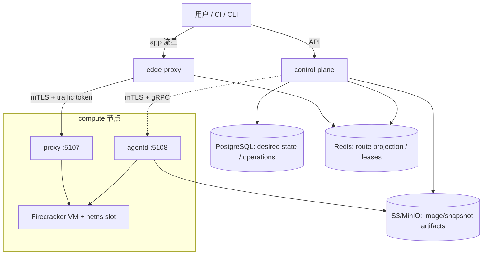

# firepaas 目标架构

> 本文冻结首个**内部生产 MVP**的架构契约；实施顺序见 [mvp-plan.md](mvp-plan.md)。
> 参考：[可行性分析](../../docs/paas-feasibility-analysis.md) 与 ADR。

## 1. 一句话

开发者提交 OCI 镜像，控制面把应用的**期望副本**调和为 Firecracker microVM；edge 按域名把流量发送给当前健康的副本。平台首版面向无状态、受信内部工作负载。

## 2. 不变原则

1. **Nomad 只编排基础设施**；用户 VM 由控制面选节点、agent 创建。
2. **控制、数据、流量面分离**：API 不进入 app 流量热路径。
3. **Postgres 是期望状态与业务事实的唯一权威**；agent 报告观测状态；Redis 只是可重建的路由/租约投影。
4. **每次改变运行态的操作均 fenced**：`machine_id + execution_id + generation + operation_id` 防止旧请求操作新一代 VM；普通查询不要求 operation fencing。
5. **先让 route 成立，再做调度优化**：`hostname → backend set → machine location` 是多副本和滚动发布的基础。
6. MVP 不承诺 node-local volume、node-local snapshot 在节点永久故障后的自动恢复，也不承诺 agent 原地升级零中断。

## 3. 拓扑



Nomad 发现并运行 `agentd` system job、API/edge service jobs；它不创建或追踪用户 VM。

## 4. 状态与调和模型

### 4.1 三类状态

| 类别 | 权威 | 内容 | 恢复方式 |
|---|---|---|---|
| Desired/business state | PostgreSQL | app、deployment、replica/machine、期望数量、generation、操作记录、配额、审计 | 备份恢复 |
| Observed runtime state | agent | 实际 VM、execution、slot、进程、健康、资源占用 | agent 启动扫描并上报 |
| Derived/ephemeral state | Redis | route backend set、machine location、reservation、短期 operation result | controller 从 PG + agent 重建 |

控制器持续比较 PG 的 desired state 与 agent observed state；它是唯一将两者调和、发布路由投影的组件。Redis 丢失不得改变 deployment 的业务结论。

### 4.2 PostgreSQL 最小模型

```text
projects(id, name, vcpu_quota, mem_mib_quota, ...)
api_keys(id, project_id, key_hash, scopes, created_at, last_used_at, ...)
secrets(id, project_id, name, version, value_ciphertext, created_at, ...)  -- ADR-0010,值仅存密文
apps(id, project_id, hostname, desired_replicas, generation, ...)
deployments(id, app_id, generation, image_digest, status, ...)
machines(id, deployment_id, replica_ordinal, desired_state, generation,
         current_execution_id, requested_vcpu, requested_mem_mib, node_id?, ...)
operations(id, machine_id, execution_id, generation, kind, idempotency_key,
           status, result, ...)
routes(id, app_id, hostname, active_generation, ...)
route_backends(route_id, generation, machine_id, execution_id, port, weight,
               readiness, draining, ...)
```

关键约束：

- `UNIQUE(deployment_id, replica_ordinal)`：一个副本槽位只有一个逻辑 machine；
- `UNIQUE(project_id, idempotency_key)`：客户端重复提交同一操作返回同一结果；
- slot 是 agent 本地资源；若需要持久记录，仅可 `UNIQUE(node_id, slot_index)`，不做全局唯一；
- domain/hostname 由 PG 全局唯一约束分配；vsock CID 由 agent 在节点范围安全分配并报告。

### 4.3 Redis 投影

```text
route:{hostname}:{port} -> {route_generation, backends[]}
machine:location:{machine_id}:{execution_id} -> {node_proxy_endpoint, app_port, credential_ref}
reservation:{machine_id}:{execution_id} -> TTL lease
operation:result:{operation_id} -> TTL cache
node:metrics:{node_id} -> latest sample
```

`route` 的 backend 只包含 readiness=true 且非 draining 的 execution；每次发布带 generation。edge 拒绝 execution 不匹配的 location，catalog miss 只触发受限查询/恢复，不自行猜测后端。`slot_ip`、netns 名称和 TAP 等均属于 agent 内部实现，不进入 edge/Redis 契约；edge 只能访问 `node_proxy_endpoint`。

**Redis 故障语义（可用性，非仅数据）**：Redis 不可用不改变业务结论（ADR-0003），数据面可用性由 edge 的 route generation 本地缓存承担——TTL 窗口内 serve-stale，超窗受控失败；恢复后由 controller 在声明的时限内重建投影。MVP 接受 Redis 单实例（AOF）；是否引入 sentinel 依据 M4 验收决定（mvp-plan §8）。

## 5. 多副本与滚动发布

外部 hostname 不映射单台 machine，而映射一个 route backend set：

```text
client → edge(hostname) → route generation → healthy backends
       → agent proxy → execution-specific VM
```

滚动控制器的顺序固定为：

1. 为新 deployment 创建所需 replica ordinal；
2. agent 观测到 VM `RUNNING`，健康检查通过；
3. 在一个事务中发布新的 route generation；
4. edge 按 generation 转发；旧 backend 标记 draining；
5. 到连接排空期限后停止/删除旧 execution；失败则保留旧 route generation。

readiness 的唯一来源是 agent 在 host 侧经内部 workload endpoint 执行的探针（M1 bridge guest IP、M3 slot IP，ADR-0008），随 observed state 上报；edge 不做应用层健康检查，不猜测后端。

MVP 采用简单 round-robin；会话粘性、灰度权重和 WebSocket 长连接迁移是后续能力。发布与 scale/节点故障/再次发布的**组合场景决策表在 M3 冻结**（mvp-plan §7）：MVP 至少实现同一 app 同时只允许一个 rollout 的互斥。

## 6. agent 契约与内部信任边界

`protos/agent/v1/agent.proto` 是唯一控制面数据面契约。

- 所有改变状态的 RPC 带 `machine_id`、`execution_id`、`generation`、`operation_id`；agent 必须持久化幂等结果并拒绝 stale generation。
- agent operation ledger 至少持久化 `operation_id/machine_id/execution_id/generation/kind/request_hash/status/result`；同一 operation ID 携带不同 request hash 必须拒绝。结果采用原子写并在 machine 删除后保留一个可配置去重窗口。
- `CreateMachine` 的幂等单位是一个稳定 machine/replica，不是 deployment。
- control-plane→agent 与 edge→agent 都使用 mTLS workload identity；agent 按调用方身份授权 RPC。
- 5108 仅接受 control-plane；5107 仅接受 edge；主机防火墙进一步限制来源。
- registry 凭证使用短期 scoped token 或 agent credential provider；禁止在长期 RPC payload、日志或 Redis 中保存密码。
- secret 值与引用分离（ADR-0010）：`secret_refs` 引用、值仅在 `CreateMachine.secret_env` 一次性下发；observed state（agent 重启扫描重建的 `Machine`）不携带秘密。
- execution-bound proxy credential 仅在 `CreateMachine.proxy_credential` 单向下发；不得进入会被返回的 `MachineSpec`、Redis、日志或 operation result，agent 只保存验证材料/摘要。
- 运行时交互（logs/exec）属于 agent 契约：`StreamLogs`/`Exec` 流式 RPC 同样受 mTLS 身份与 execution fencing 约束，由控制面代理 CLI/用户调用（属运维通道，不是 app 流量）；`Machine.log_url` 仅指向归档日志，不承担实时通道。MVP 的 Exec 断线即终止，只保证会话创建幂等，不承诺输出续传或重新 attach。

## 7. 放置与恢复

控制面使用 Best-of-K 作为**软决策**；agent 以本机真实资源做硬准入。调度管线**先过滤后打分**（ADR-0009）：状态/资源/label/node_pool 硬过滤、DEPLOYMENT 尽力反亲和（候选不足可降级并记录调度事件）；CPU 超售比例、内存超售、K、Alpha 都是 P0 基准后的可配置值，初始 `R=4/K=3/Alpha=0.5/memory=1.0` 不是承诺值。

恢复优先 origin node；origin 不可达时：无状态 VM 可冷启动重建；node-local 快照仅作为加速，不提供跨节点恢复保证。

## 8. 网络与安全基线

- M1 即建立唯一正式流量边界 `edge → agent proxy → workload endpoint`；M1 的 workload endpoint 可由 bridge adapter 提供，M3 切换为 netns slot 时不改变 edge/catalog 契约；
- M3 起每个 VM 使用独立 netns slot、cgroup v2、nftables 默认拒绝宿主机与私网；
- 不做 overlay 或跨节点 VM 私网直连；跨节点业务流量经 edge/agent proxy；
- agent 以 root 运行，是受 mTLS、网络 ACL 和最小 RPC 授权保护的可信组件；
- MVP 面向受信内部租户，仍必须拒绝跨 project API/路由访问与 guest→host 访问；
- edge 入口：M1–M3 DNS 轮询、M4 keepalived VIP；TLS 由 step-ca 内部 CA 经 Caddy ACME 集成按需签发泛域名证书，客户端根证书预置是运维前置而不是平台功能（ADR-0011）。

## 9. SLO 适用范围

| 工作负载 | 目标 |
|---|---|
| 无状态、镜像已缓存 | cold start p95 < 5s（以 P0 实测为准） |
| 无状态、镜像未缓存 | cold start p95 < 60s（镜像/网络条件记录在案） |
| standby 可用且 origin node 健康 | resume p95 < 1s，autoresume p95 < 5s |
| 节点失联的无状态预热副本 | 检出 < 60s；检测后 ready < 120s 的目标仅适用于预热镜像 |
| node-local volume / snapshot | 不提供节点永久故障后的 RTO/RPO 承诺 |
